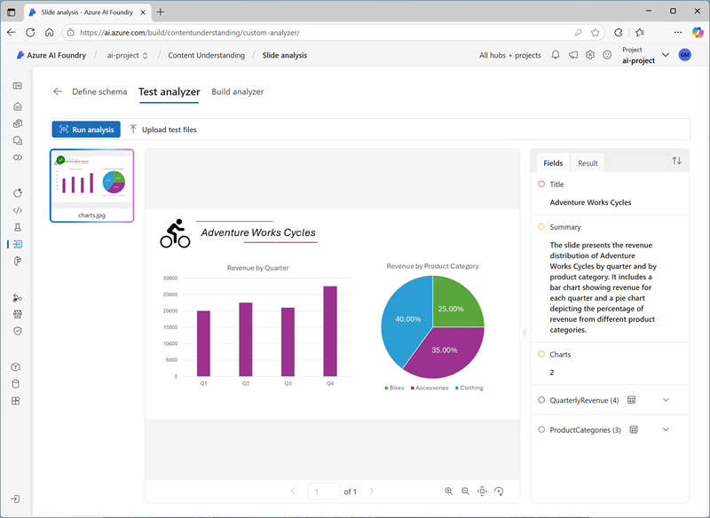
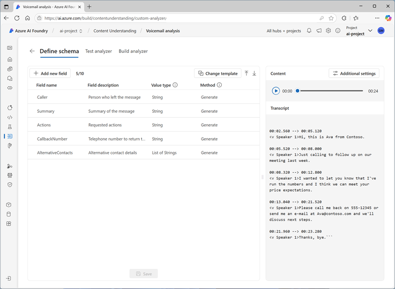
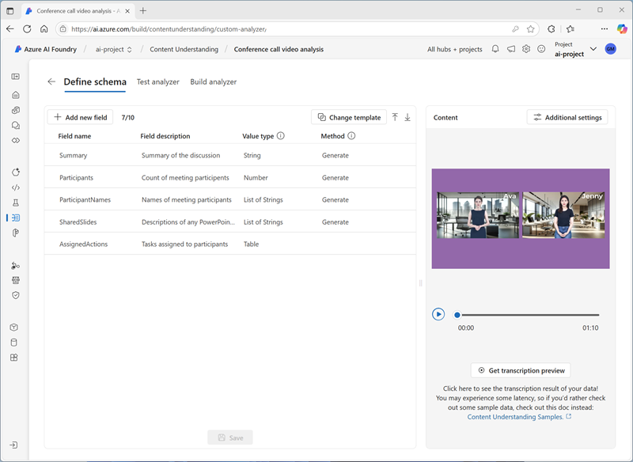

---
lab:
  title: Extraer información del contenido multimodal
  description: 'Use Servicio de comprensión de contenido de IA de Azure para extraer información de documentos, imágenes, grabaciones de audio y vídeos.'
---

# Extraer información del contenido multimodal

En este ejercicio, usará Servicio de comprensión de contenido de Azure para extraer información de diversos tipos de contenido; incluyendo una factura, una imagen de una diapositiva que contiene gráficos, una grabación de audio de mensajes de voz y una grabación de vídeo de una llamada de conferencia.

Este ejercicio dura aproximadamente **40** minutos.

## Creación de un centro y un proyecto de Fundición de IA de Azure

Las características de Fundición de IA de Azure que usaremos en este ejercicio requieren un proyecto basado en un recurso del *centro* de Fundición de IA de Azure.

1. En un explorador web, abre el [Portal de la Fundición de IA de Azure](https://ai.azure.com) en `https://ai.azure.com` e inicia sesión con tus credenciales de Azure. Cierra las sugerencias o paneles de inicio rápido que se abran la primera vez que inicias sesión y, si es necesario, usa el logotipo de **Fundición de IA de Azure** en la parte superior izquierda para navegar a la página principal, que es similar a la siguiente imagen (cierra el panel **Ayuda** si está abierto):

    

1. En el explorador, accede a `https://ai.azure.com/managementCenter/allResources` y selecciona **Crear nuevo**. A continuación, elige la opción para crear un nuevo **recurso del centro de IA**.
1. En el asistente para **crear un proyecto**, escribe un nombre válido para tu proyecto y selecciona la opción para crear un centro. A continuación, usa el vínculo **Cambiar nombre del centro** para especificar un nombre válido para el nuevo centro, expande **Opciones avanzadas** y especifica la siguiente configuración para el proyecto:
    - **Suscripción**: *suscripción a Azure*
    - **Grupo de recursos**: *crea o selecciona un grupo de recursos*
    - **Región**:  seleccione una de las siguientes ubicaciones (*En el momento de escribir este documento, Servicio de comprensión de contenido de IA de Azure solo está disponible en estas regiones*):
        - Este de Australia
        - Centro de Suecia
        - Oeste de EE. UU.

    > **Nota**: Si trabajas en una suscripción a Azure en la que se usan directivas para restringir los nombres de recursos permitidos, es posible que tengas que usar el vínculo situado en la parte inferior del cuadro de diálogo **Crear un nuevo proyecto** para crear el centro con Azure Portal.

    > **Sugerencia**: si el botón **Crear** sigue deshabilitado, asegúrate de cambiar el nombre del centro a un valor alfanumérico único.

1. Espera a que se cree el proyecto.

## Descargar contenido de 

El contenido que va a analizar se encuentra en un archivo .zip. Descárguelo y extráigalo en una carpeta local.

1. En una nueva pestaña del explorador, descargue [content.zip](https://github.com/microsoftlearning/mslearn-ai-information-extraction/raw/main/Labfiles/content/content.zip) desde `https://github.com/microsoftlearning/mslearn-ai-information-extraction/raw/main/Labfiles/content/content.zip` y guárdelo en una carpeta local.
1. Extraiga el archivo *content.zip* descargado y vea los archivos que contiene. Usará estos archivos para compilar varios analizadores de Servicio de comprensión de contenido en este ejercicio.

> **Nota**: Si solo le interesa explorar el análisis de una modalidad específica (documentos, imágenes, vídeo o audio), puede ir directamente a la tarea pertinente siguiente. Para obtener la mejor experiencia, desarrolle cada tarea para aprender a extraer información de diferentes tipos de contenido.

## Extracción de información de documentos de facturas

Va a crear un analizador de Servicio de comprensión de contenido de IA de Azure que pueda extraer información de facturas. Empezarás por la definición un esquema basado en una factura de ejemplo.

### Definición de un esquema para el análisis de facturas

1. En la pestaña del explorador que contiene la página principal del proyecto de Fundición de IA de Azure, en el panel de navegación de la izquierda, seleccione **Comprensión de contenidos**.
1. En la página **Comprensión de contenidos**, seleccione la pestaña **Tarea personalizada** en la parte superior.
1. En la página de la tarea personalizada Comprensión de contenidos, seleccione **+ Crear** y cree una tarea con la siguiente configuración:
    - **Nombre de tarea**: `Invoice analysis`
    - **Descripción**: `Extract data from an invoice`
    - **Análisis de contenido de un solo archivo**: *Seleccionado*
    - **Configuración avanzada**:
        - **Conexión de Servicios de Azure AI**: *El un recurso de Servicios de Azure AI en el centro de Fundición de IA de Azure*
        - **Cuenta de Azure Blob Storage**: *la cuenta de almacenamiento predeterminada en el centro de Fundición de IA de Azure*
1. Espera a que se cree la tarea.

    > **Sugerencia**: si se produce un error al acceder al almacenamiento, espera un minuto e inténtalo de nuevo. Los permisos de un nuevo centro pueden tardar unos minutos en propagarse.

1. En la página **Definir esquema**, cargue el archivo **invoice-1234.pdf** desde la carpeta donde ha extraído los archivos de contenido. Este archivo contiene la factura siguiente:

    

1. En la página **Definir esquema**, después de cargar el archivo de factura, seleccione la plantilla **Extracción de datos de factura** y seleccione **Crear**.

    La plantilla *Análisis de factura* incluye campos comunes que se encuentran en las facturas. Puede usar el editor de esquemas para eliminar cualquiera de los campos sugeridos que no necesite y agregar los campos personalizados que sí necesite.

1. En la lista de campos sugeridos, selecciona **BillingAddress**. Este campo no es necesario para el formato de factura que ha cargado, así que use el icono **Eliminar campo** (**&#128465;**) que aparece en la fila del campo seleccionado para eliminarlo.
1. Ahora, elimine los siguientes campos sugeridos, que no son necesarios para el esquema de factura:
    - BillingAddressRecipient
    - CustomerAddressRecipient
    - CustomerId
    - CustomerTaxId
    - DueDate
    - InvoiceTotal
    - PaymentTerm
    - PreviousUnpaidBalance
    - PurchaseOrder
    - RemittanceAddress
    - RemittanceAddressRecipient
    - ServiceAddress
    - ServiceAddressRecipient
    - ShippingAddress
    - ShippingAddressRecipient
    - TotalDiscount
    - VendorAddressRecipient
    - VendorTaxId
    - TaxDetails
1. Use el botón **+ Agregar nuevo campo** para agregar los siguientes campos y seleccione **Guardar cambios** (**&#10003;**) para cada campo nuevo:

    | Nombre del campo | Descripción del campo | Tipo de valor | Método |
    |--|--|--|--|
    | `VendorPhone` | `Vendor telephone number` | Cadena | Extracto |
    | `ShippingFee` | `Fee for shipping` | Número | Extracto |

1. En la fila del campo **Elementos**, observe que es una *tabla* (contiene la colección de elementos de la factura). Seleccione el icono **Editar** (&#9638;) para abrir una nueva página con sus subcampos.
1. Quite los siguientes subcampos de la tabla **Elementos**:
    - Fecha
    - ProductCode
    - Unidad
    - TaxAmount
    - TaxRate
1. Use el botón **Aceptar** para confirmar los cambios y volver al nivel superior del esquema de factura.

1. Compruebe que el esquema completado tiene este aspecto y seleccione **Guardar**.

    

1. En la página **Analizador de pruebas**, si el análisis no se inicia automáticamente, selecciona **Ejecutar análisis**. Después, espere a que se complete el análisis.

1. Revisa los resultados del análisis, que deben ser similares a esto:

    

1. Vea los detalles de los campos identificados en el panel **Campos**.

### Creación y prueba de un analizador de facturas

Ahora que ha entrenado un modelo para extraer campos de facturas, puede crear un analizador para usarlo con documentos similares.

1. Seleccione la página **Lista de analizadores**, después **+ Crear analizador** y cree un analizador con las siguientes propiedades (debe escribirlas exactamente como se muestran aquí):
    - **Nombre**: `invoice-analyzer`
    - **Descripción**: `Invoice analyzer`
1. Espera a que el nuevo analizador esté listo (usa el botón **Actualizar** para comprobar).
1. Cuando se haya creado el analizador, seleccione el vínculo **invoice-analyzer**. Se mostrarán los campos definidos en el esquema del analizador.
1. En la página **invoice-analyzer**, seleccione la pestaña **Probar**.
1. Use el botón **+ Cargar archivos de prueba** para cargar **invoice-1235.pdf** desde la carpeta donde ha extraído los archivos de contenido y haga clic en **Ejecutar análisis** para extraer datos de campo de la factura.

    La factura que se analiza tiene el siguiente aspecto:

    

1. Revise el panel **Campos** y compruebe que el analizador ha extraído los campos correctos de la factura de prueba.
1. Revise el panel **Resultados** para ver la respuesta JSON que el analizador devolvería a una aplicación cliente.
1. En la pestaña **Ejemplo de código**, vea el código de ejemplo que podría usar para desarrollar una aplicación cliente que use la interfaz REST de comprensión de contenidos para llamar al analizador.
1. Cierre la página **invoice-analyzer**.

## Extracción de información de una imagen de diapositiva

Va a crear un analizador de Servicio de comprensión de contenido de IA de Azure que pueda extraer información de una diapositiva que contiene gráficos.

### Definición de un esquema para el análisis de imágenes

1. En la pestaña del explorador que contiene la página principal del proyecto de Fundición de IA de Azure, en el panel de navegación de la izquierda, seleccione **Comprensión de contenidos**.
1. En la página **Comprensión de contenidos**, seleccione la pestaña **Tarea personalizada** en la parte superior.
1. En la página de la tarea personalizada Comprensión de contenidos, seleccione **+ Crear** y cree una tarea con la siguiente configuración:
    - **Nombre de tarea**: `Slide analysis`
    - **Descripción**: `Extract data from an image of a slide`
    - **Análisis de contenido de un solo archivo**: *Seleccionado*
    - **Configuración avanzada**:
        - **Conexión de Servicios de Azure AI**: *El un recurso de Servicios de Azure AI en el centro de Fundición de IA de Azure*
        - **Cuenta de Azure Blob Storage**: *la cuenta de almacenamiento predeterminada en el centro de Fundición de IA de Azure*
1. Espera a que se cree la tarea.

    > **Sugerencia**: si se produce un error al acceder al almacenamiento, espera un minuto e inténtalo de nuevo. Los permisos de un nuevo centro pueden tardar unos minutos en propagarse.

1. En la página **Definir esquema**, cargue el archivo **slide-1.jpg** desde la carpeta donde ha extraído los archivos de contenido. Después, seleccione la plantilla **Análisis de imágenes** y luego **Crear**.

    La plantilla *Análisis de imágenes* no incluye ningún campo predefinido. Debe definir campos para describir la información que quiere extraer.

1. Use el botón **+ Agregar nuevo campo** para agregar los siguientes campos y seleccione **Guardar cambios** (**&#10003;**) para cada campo nuevo:

    | Nombre del campo | Descripción del campo | Tipo de valor | Método |
    |--|--|--|--|
    | `Title` | `Slide title` | Cadena | Generate |
    | `Summary` | `Summary of the slide` | Cadena | Generate |
    | `Charts` | `Number of charts on the slide` | Entero | Generate |

1. Use el botón **+ Agregar nuevo campo** para agregar un nuevo campo denominado `QuarterlyRevenue` con la descripción `Revenue per quarter` con el tipo de valor **Tabla** y guarde el nuevo campo (**&#10003;**). Después, en la nueva página de los subcampos de tabla que se abre, agregue los siguientes subcampos:

    | Nombre del campo | Descripción del campo | Tipo de valor | Método |
    |--|--|--|--|
    | `Quarter` | `Which quarter?` | Cadena | Generate |
    | `Revenue` | `Revenue for the quarter` | Número | Generate |

1. Seleccione **Atrás** (el icono de flecha cerca del botón **Agregar nuevo subcampo**) o **&#10003; OK** para volver al nivel superior del esquema y use el botón **+ Agregar nuevo campo** para agregar un campo con el nombre `ProductCategories`, la descripción `Product categories` y el tipo de valor **Tabla**, y guarde el nuevo campo (**&#10003;**). Después, en la nueva página de los subcampos de tabla que se abre, agregue los siguientes subcampos:

    | Nombre del campo | Descripción del campo | Tipo de valor | Método |
    |--|--|--|--|
    | `ProductCategory` | `Product category name` | Cadena | Generate |
    | `RevenuePercentage` | `Percentage of revenue` | Número | Generate |

1. Seleccione **Atrás** (el icono de flecha junto al botón **Agregar nuevo subcampo**) o **&#10003; Aceptar** para volver al nivel superior del esquema y comprobar que tiene este aspecto. Después, seleccione **Guardar**.

    

1. En la página **Analizador de pruebas**, si el análisis no se inicia automáticamente, selecciona **Ejecutar análisis**. Después, espere a que se complete el análisis.

    La diapositiva que se analiza tiene el siguiente aspecto:

    

1. Revisa los resultados del análisis, que deben ser similares a esto:

    

1. Vea los detalles de los campos identificados en el panel **Campos** y expanda los campos **QuarterlyRevenue** y **ProductCategories** para ver los valores de subcampo.

### Compilación y prueba de un analizador

Ahora que ha entrenado un modelo para extraer campos de diapositivas, puede crear un analizador para usarlo con imágenes de diapositivas similares.

1. Seleccione la página **Lista de analizadores**, después **+ Crear analizador** y cree un analizador con las siguientes propiedades (debe escribirlas exactamente como se muestran aquí):
    - **Nombre**: `slide-analyzer`
    - **Descripción**: `Slide image analyzer`
1. Espera a que el nuevo analizador esté listo (usa el botón **Actualizar** para comprobar).
1. Cuando se haya creado el analizador, seleccione el vínculo **slide-analyzer**. Se mostrarán los campos definidos en el esquema del analizador.
1. En la página **slide-analyzer**, seleccione la pestaña **Probar**.
1. Use el botón **+ Cargar archivos de prueba** para cargar **slide-2.jpg** desde la carpeta donde ha extraído los archivos de contenido y haga clic en **Ejecutar análisis** para extraer datos de campo de la imagen.

    La diapositiva que se analiza tiene el siguiente aspecto:

    

1. Revise el panel **Campos** y compruebe que el analizador ha extraído los campos correctos de la imagen de diapositiva.

    > **Nota**: La diapositiva 2 no incluye un desglose por categoría de producto, por lo que no se han encontrado datos de ingresos de la categoría de producto.

1. Revise el panel **Resultados** para ver la respuesta JSON que el analizador devolvería a una aplicación cliente.
1. En la pestaña **Ejemplo de código**, vea el código de ejemplo que puede usar para desarrollar una aplicación cliente que use la interfaz REST de comprensión de contenidos para llamar al analizador.
1. Cierre la página **slide-analyzer**.

## Extraer información de una grabación de audio de correo de voz

Va a crear un analizador de Servicio de comprensión de contenido de IA de Azure que pueda extraer información de una grabación de audio de un mensaje de correo de voz.

### Definición de un esquema para el análisis de audio

1. En la pestaña del explorador que contiene la página principal del proyecto de Fundición de IA de Azure, en el panel de navegación de la izquierda, seleccione **Comprensión de contenidos**.
1. En la página **Comprensión de contenidos**, seleccione la pestaña **Tarea personalizada** en la parte superior.
1. En la página de la tarea personalizada Comprensión de contenidos, seleccione **+ Crear** y cree una tarea con la siguiente configuración:
    - **Nombre de tarea**: `Voicemail analysis`
    - **Descripción**: `Extract data from a voicemail recording`
    - **Análisis de contenido de un solo archivo**: *Seleccionado*
    - **Configuración avanzada**:
        - **Conexión de Servicios de Azure AI**: *El un recurso de Servicios de Azure AI en el centro de Fundición de IA de Azure*
        - **Cuenta de Azure Blob Storage**: *la cuenta de almacenamiento predeterminada en el centro de Fundición de IA de Azure*
1. Espera a que se cree la tarea.

    > **Sugerencia**: si se produce un error al acceder al almacenamiento, espera un minuto e inténtalo de nuevo. Los permisos de un nuevo centro pueden tardar unos minutos en propagarse.

1. En la página **Definir esquema**, cargue el archivo **call-1.mp3** desde la carpeta donde ha extraído los archivos de contenido. Después, seleccione la plantilla **Análisis de transcripciones de voz** y seleccione **Crear**.
1. En el panel **Contenido** de la derecha, seleccione **Obtener vista previa de la transcripción** para ver una transcripción del mensaje grabado.

    La plantilla *Análisis de transcripciones de voz* no incluye ningún campo predefinido. Debe definir campos para describir la información que quiere extraer.

1. Use el botón **+ Agregar nuevo campo** para agregar los siguientes campos y seleccione **Guardar cambios** (**&#10003;**) para cada campo nuevo:

    | Nombre del campo | Descripción del campo | Tipo de valor | Método |
    |--|--|--|--|
    | `Caller` | `Person who left the message` | Cadena | Generate |
    | `Summary` | `Summary of the message` | Cadena | Generate |
    | `Actions` | `Requested actions` | Cadena | Generate |
    | `CallbackNumber` | `Telephone number to return the call` | Cadena | Generate |
    | `AlternativeContacts` | `Alternative contact details` | Lista de cadenas | Generate |

1. Compruebe que el flujo de datos tenga este aspecto. Después, seleccione **Guardar**.

    

1. En la página **Analizador de pruebas**, si el análisis no se inicia automáticamente, selecciona **Ejecutar análisis**. Después, espere a que se complete el análisis.

    El análisis de audio puede tardar algún tiempo. Mientras espera, puede reproducir el archivo de audio siguiente:

    <video controls src="https://github.com/MicrosoftLearning/mslearn-ai-information-extraction/raw/refs/heads/main/Instructions/Labs/media/call-1.mp4" title="Llame al 1" width="300">
        <track src="https://github.com/MicrosoftLearning/mslearn-ai-information-extraction/raw/refs/heads/main/Instructions/Labs/media/call-1.vtt" kind="captions" srclang="en" label="English">
    </video>

    **Nota**: Este audio se ha generado mediante inteligencia artificial.

1. Revisa los resultados del análisis, que deben ser similares a esto:

    

1. Vea los detalles de los campos identificados en el panel **Campos** y expanda el campo **AlternativeContacts** para ver los valores enumerados.

### Compilación y prueba de un analizador

Ahora que ha entrenado un modelo para extraer campos de mensajes de voz, puede crear un analizador para usarlo con grabaciones de audio similares.

1. Seleccione la página **Lista de analizadores**, después **+ Crear analizador** y cree un analizador con las siguientes propiedades (debe escribirlas exactamente como se muestran aquí):
    - **Nombre**: `voicemail-analyzer`
    - **Descripción**: `Voicemail audio analyzer`
1. Espera a que el nuevo analizador esté listo (usa el botón **Actualizar** para comprobar).
1. Cuando se haya creado el analizador, seleccione el vínculo **voicemail-analyzer**. Se mostrarán los campos definidos en el esquema del analizador.
1. En la página **voicemail-analyzer**, seleccione la pestaña **Probar**.
1. Use el botón **+ Cargar archivos de prueba** para cargar **call-2.mp3** desde la carpeta donde ha extraído los archivos de contenido y haga clic en **Ejecutar análisis** para extraer datos de campo del archivo de audio.

    El análisis de audio puede tardar algún tiempo. Mientras espera, puede reproducir el archivo de audio siguiente:

    <video controls src="https://github.com/MicrosoftLearning/mslearn-ai-information-extraction/raw/refs/heads/main/Instructions/Labs/media/call-2.mp4" title="Llamada 2" width="300">
        <track src="https://github.com/MicrosoftLearning/mslearn-ai-information-extraction/raw/refs/heads/main/Instructions/Labs/media/call-2.vtt" kind="captions" srclang="en" label="English">
    </video>

    **Nota**: Este audio se ha generado mediante inteligencia artificial.

1. Revise el panel **Campos** y compruebe que el analizador ha extraído los campos correctos del mensaje de voz.
1. Revise el panel **Resultados** para ver la respuesta JSON que el analizador devolvería a una aplicación cliente.
1. En la pestaña **Ejemplo de código**, vea el código de ejemplo que puede usar para desarrollar una aplicación cliente que use la interfaz REST de comprensión de contenidos para llamar al analizador.
1. Cierre la página **voicemail-analyzer**.

## Extracción de información de una grabación de videoconferencia

Va a crear un analizador de Servicio de comprensión de contenido de IA de Azure que pueda extraer información de una grabación en vídeo de una llamada de conferencia.

### Definición de un esquema para el análisis de vídeo

1. En la pestaña del explorador que contiene la página principal del proyecto de Fundición de IA de Azure, en el panel de navegación de la izquierda, seleccione **Comprensión de contenidos**.
1. En la página **Comprensión de contenidos**, seleccione la pestaña **Tarea personalizada** en la parte superior.
1. En la página de la tarea personalizada Comprensión de contenidos, seleccione **+ Crear** y cree una tarea con la siguiente configuración:
    - **Nombre de tarea**: `Conference call video analysis`
    - **Descripción**: `Extract data from a video conference recording`
    - **Análisis de contenido de un solo archivo**: *Seleccionado*
    - **Configuración avanzada**:
        - **Conexión de Servicios de Azure AI**: *El un recurso de Servicios de Azure AI en el centro de Fundición de IA de Azure*
        - **Cuenta de Azure Blob Storage**: *la cuenta de almacenamiento predeterminada en el centro de Fundición de IA de Azure*
1. Espera a que se cree la tarea.

    > **Sugerencia**: si se produce un error al acceder al almacenamiento, espera un minuto e inténtalo de nuevo. Los permisos de un nuevo centro pueden tardar unos minutos en propagarse.

1. En la página **Definir esquema**, cargue el archivo **meeting-1.mp4** desde la carpeta donde ha extraído los archivos de contenido. Después, seleccione la plantilla **Análisis de vídeo** y luego **Crear**.
1. En el panel **Contenido** de la derecha, seleccione **Obtener vista previa de la transcripción** para ver una transcripción del mensaje grabado.

    La plantilla *Análisis de vídeo* extrae los datos del vídeo. No incluye ningún campo predefinido. Debe definir campos para describir la información que quiere extraer.

1. Use el botón **+ Agregar nuevo campo** para agregar los siguientes campos y seleccione **Guardar cambios** (**&#10003;**) para cada campo nuevo:

    | Nombre del campo | Descripción del campo | Tipo de valor | Método |
    |--|--|--|--|
    | `Summary` | `Summary of the discussion` | Cadena | Generate |
    | `Participants` | `Count of meeting participants` | Entero | Generate |
    | `ParticipantNames` | `Names of meeting participants` | Lista de cadenas | Generate |
    | `SharedSlides` | `Descriptions of any PowerPoint slides presented` | Lista de cadenas | Generate |
    | `AssignedActions` | `Tasks assigned to participants` | Tabla |  |

1. Al acceder al campo **AssignedActions**, en la tabla de subcampos que aparece, cree los siguientes subcampos:

    | Nombre del campo | Descripción del campo | Tipo de valor | Método |
    |--|--|--|--|
    | `Task` | `Description of the task` | Cadena | Generate |
    | `AssignedTo` | `Who the task is assigned to` | Cadena | Generate |

1. Seleccione **Atrás** (el icono de flecha junto al botón **Agregar nuevo subcampo**) o **&#10003; Aceptar** para volver al nivel superior del esquema y comprobar que tiene este aspecto. Después, seleccione **Guardar**.

1. Compruebe que el flujo de datos tenga este aspecto. Después, seleccione **Guardar**.

    

1. En la página **Analizador de pruebas**, si el análisis no se inicia automáticamente, selecciona **Ejecutar análisis**. Después, espere a que se complete el análisis.

    El análisis de vídeo puede tardar algún tiempo. Mientras espera, puede ver el vídeo siguiente:

    <video controls src="https://github.com/MicrosoftLearning/mslearn-ai-information-extraction/raw/refs/heads/main/Instructions/Labs/media/meeting-1.mp4" title="Reunión 1" width="480">
        <track src="https://github.com/MicrosoftLearning/mslearn-ai-information-extraction/raw/refs/heads/main/Instructions/Labs/media/meeting-1.vtt" kind="captions" srclang="en" label="English">
    </video>

    **Nota**: Este vídeo se ha generado mediante inteligencia artificial.

1. Cuando finalice el análisis, revise los resultados, que deben ser similares a los siguientes:

    

1. En el panel **Campos**, vea los datos extraídos del vídeo, incluidos los campos que ha agregado. Vea los valores de campo que se han generado y expanda los campos de lista y tabla según sea necesario.

### Compilación y prueba de un analizador

Ahora que ha entrenado un modelo para extraer campos de grabaciones de llamada de conferencia, puede crear un analizador para usarlo con vídeos similares.

1. Seleccione la página **Lista de analizadores**, después **+ Crear analizador** y cree un analizador con las siguientes propiedades (debe escribirlas exactamente como se muestran aquí):
    - **Nombre**: `conference-call-analyzer`
    - **Descripción**: `Conference call video analyzer`
1. Espera a que el nuevo analizador esté listo (usa el botón **Actualizar** para comprobar).
1. Cuando se haya creado el analizador, seleccione el vínculo **conference-call-analyzer**. Se mostrarán los campos definidos en el esquema del analizador.
1. En la página **conference-call-analyzer**, seleccione la pestaña **Probar**.
1. Use el botón **Cargar archivos de prueba** para cargar **meeting-2.mp4** desde la carpeta donde ha extraído los archivos de contenido y ejecute el análisis para extraer datos de campo del archivo de audio.

    El análisis de vídeo puede tardar algún tiempo. Mientras espera, puede ver el vídeo siguiente:

    <video controls src="https://github.com/MicrosoftLearning/mslearn-ai-information-extraction/raw/refs/heads/main/Instructions/Labs/media/meeting-2.mp4" title="Reunión 2" width="480">
        <track src="https://github.com/MicrosoftLearning/mslearn-ai-information-extraction/raw/refs/heads/main/Instructions/Labs/media/meeting-2.vtt" kind="captions" srclang="en" label="English">
    </video>

    **Nota**: Este vídeo se ha generado mediante inteligencia artificial.

1. Revise el panel **Campos** y vea los campos extraídos por el analizador para el vídeo de la llamada de conferencia.
1. Revise el panel **Resultados** para ver la respuesta JSON que el analizador devolvería a una aplicación cliente.
1. Cierre la página **conference-call-analyzer**.

## Limpieza

Si has terminado de trabajar con el servicio de comprensión de contenidos, deberías eliminar los recursos que has creado en este ejercicio para evitar incurrir en costes innecesarios de Azure.

1. En el Portal de la Fundición de IA de Azure, vaya al centro, en la página de información general, seleccione el proyecto y elimínelo.
1. En Azure Portal, elimina el grupo de recursos que has creado en este ejercicio.
